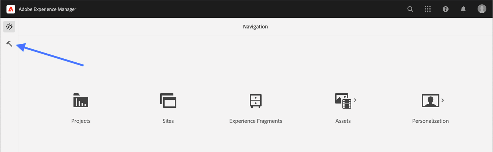
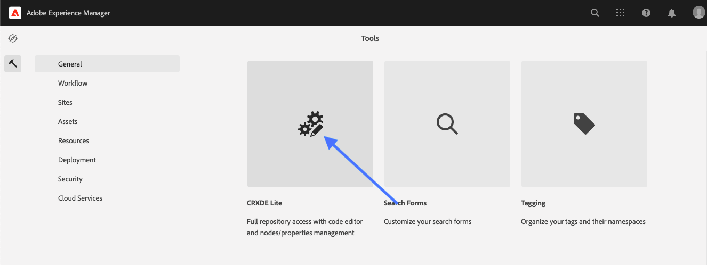
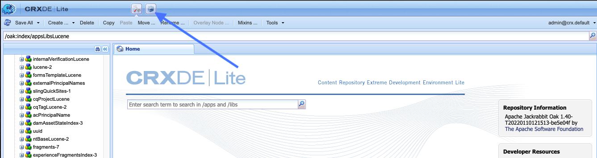

# CRX Package Manager

## Accessing the CRX Package Manager
### Via URL
You can access CRX Package Manager directly by navigating to [http://localhost:4502/crx/packmgr/index.jsp](http://localhost:4502/crx/packmgr/index.jsp), or through the Author GUI like so: 

### Via Author GUI
#### Step 1
From the landing page ([http://alocalhost:4502/aem/start.html](http://localhost:4502/aem/start.html), click on the Tools icon.

#### 2
Click on CRXDE Lite.

#### 3
Click on the Package icon.

## Looking Around
Note that some packages are installed "out of the box". Each package has a .zip filename, version, "last installed", TODO: "admin" -- is this "installed by"?, and a description. Here are some of the descriptions, quoted from the pre-installed content:
- Content package for the Content Fragment GraphQL extension
- Installation package that contains repository content for Adobe CQ Remote DAM
- Content package for the Sites GraphQL implementation
- Installation package that contains repository content for DAM Projects Addons
- Content package for the headless implementation of DAM Content Fragment Management
- Content package for the DAM Content Fragment Management module
- Content package for the Content Insight and Recommendations module
- And many more...

As you can see, these packages have to do with the basic functionality of AEM rather than anything specific to your project.